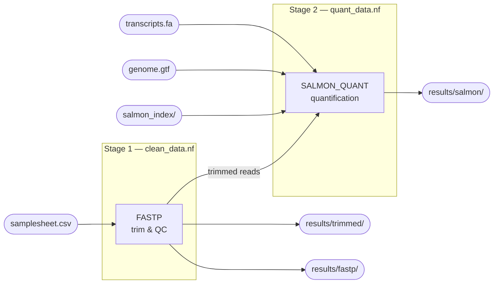

# Nextflow Best Practices

My recommendations for Nextflow and nf-core best practices.

## Nextflow & nf-core: Beyond the Basics

This repository is intended to be a living guide to advanced Nextflow patterns.
The reader is expected to be familiar with programming in Nextflow and nf-core.
While [nf-core](https://nf-co.re/) provides a good foundation, it revolves around
community participation, and as a result, favours ease of composition rather than
efficiency. This repository demonstrates how to use the tools to make efficient
and user friendly pipelines.

## Key Concepts Demonstrated:

- **Multiple Entry Workflows:** Large workflows can become difficult to manage and
often users want to run individual stages or multiple stages similar to how one might
use Snakemake. Each stage is a standalone script (`clean_data.nf`, `quant_data.nf`)
as well as an end-to-end combined entry point (`main.nf`).
- **Module Patching:** How to use `nf-core modules patch` to optimize community modules
for performance without breaking update compatibility.
- **Workflow outputs:** Uses the modern `publish:` + `output {}` pattern (Nextflow ≥ 24.04)
instead of `publishDir` directives, keeping publishing logic in the entry workflow
and out of reusable modules.

## Pipeline Overview



Both stages are wired together in `main.nf`. They can also be run individually
(e.g. to resume from trimmed reads without re-running trimming).

## Usage

### All-in-one (main.nf)

Runs trimming and quantification in a single command:

```bash
nextflow run main.nf \
    -profile docker \
    --input      samplesheet.csv \
    --outdir     results \
    --salmon_index path/to/salmon_index \
    --gtf          path/to/genome.gtf \
    --transcript_fasta path/to/transcripts.fa
```

### Stage 1 only — trimming & QC (clean_data.nf)

Useful when you only need trimmed reads and fastp reports, or want to inspect
quality before committing to quantification:

```bash
nextflow run clean_data.nf \
    -profile docker \
    --input  samplesheet.csv \
    --outdir results
```

Outputs:
- `results/trimmed/` — trimmed FASTQ files
- `results/fastp/`   — JSON and HTML QC reports

### Stage 2 only — quantification (quant_data.nf)

Run after trimming, pointing `--input` at the trimmed reads samplesheet:

```bash
nextflow run quant_data.nf \
    -profile docker \
    --input            trimmed_samplesheet.csv \
    --outdir           results \
    --salmon_index     path/to/salmon_index \
    --gtf              path/to/genome.gtf \
    --transcript_fasta path/to/transcripts.fa
```

Outputs:
- `results/salmon/` — per-sample Salmon quantification directories

See [CONTRIBUTORS.md](CONTRIBUTORS.md) for contribution, development, and testing instructions.
