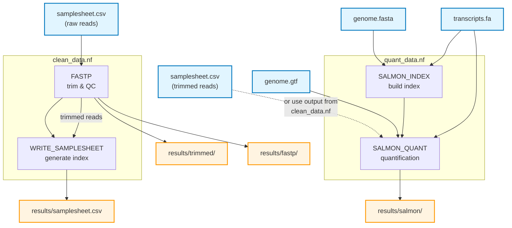

# Nextflow Multi-Entry Workflow Demo

This is a demonstration of how to use multiple entry workflows in Nextflow.

> [!TIP]
> **Conclusion**: Using multiple entry workflows simply increases the maintenance burden. 
In order to use multiple entry workflows with nf-schema, one must either maintain separate schemas
or gate each stage with a parameter. One main.nf and a `stages` parameter suffices. Writing indices
means each stage can be run separately. The input can be configured to read a samplesheet using a
different schema from each stage depending on the value of the `stages` parameter.

## Pipeline Overview



**main.nf** runs both stages sequentially: `clean_data.nf` → `quant_data.nf`

Both stages can also be run independently:
- **clean_data.nf**: Produces trimmed reads and a samplesheet for the next stage
- **quant_data.nf**: Can start from trimmed reads (either from `clean_data.nf` or existing data)

## Usage

### All-in-one (main.nf)

Runs trimming and quantification in a single command:

```bash
nextflow run main.nf \
    -profile docker \
    --input            samplesheet.csv \
    --outdir           results \
    --genome_fasta     path/to/genome.fa \
    --gtf              path/to/genome.gtf \
    --transcript_fasta path/to/transcripts.fa
```

### Stage 1 only — trimming & QC (clean_data.nf)

Useful when you only need trimmed reads and fastp reports, or want to inspect quality before committing to quantification:

```bash
nextflow run clean_data.nf \
    -profile docker \
    --input  samplesheet.csv \
    --outdir results
```

**Outputs:**
- `results/trimmed/` — trimmed FASTQ files
- `results/fastp/` — JSON and HTML QC reports
- `results/samplesheet.csv` — index for passing to `quant_data.nf`

### Stage 2 only — quantification (quant_data.nf)

Run after trimming, pointing `--input` at the generated samplesheet:

```bash
nextflow run quant_data.nf \
    -profile docker \
    --input            results/samplesheet.csv \
    --outdir           results \
    --genome_fasta     path/to/genome.fa \
    --gtf              path/to/genome.gtf \
    --transcript_fasta path/to/transcripts.fa
```

**Outputs:**
- `results/salmon/` — per-sample Salmon quantification directories
